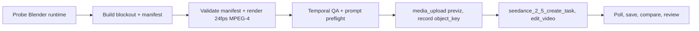

# Blender to Seedance

Turn a Blender blockout into a Seedance 2.5 video by making the **previz render
the motion master**. The model dresses the world; the 3D scene owns the camera,
cuts, blocking, and timing.

Core principle from the Higgsfield Blender workflow: **block it in 3D, lock the
camera, then make the AI execute your shot instead of rolling the dice.** The
blocking is reusable — swap the character, swap the location, keep the exact
same moves.

For project work, initialize or resume the persistent production canvas. Put the
blockout, dummy map and prompt in `storyboard-visual-plan`; put generated takes,
their exact prompts/references and QA in `shot-generation`. Regenerate and
freshness-check the HTML after each step rather than opening assets separately.



## When to use

- The shot needs **camera, cuts, or timing locked** before spending video
  credits — one-takes, multi-cut dialogue, complex camera paths, product
  re-skins.
- A scene where one previz should render in **multiple styles** (the car
  commercial pattern).
- A movement-heavy or blocking-heavy shot where text-only direction keeps
  drifting.

Do **not** use when:

- The gray *is* the final look → `seedance-graybox-world`.
- It's a plain T2V/I2V shot with no 3D preplan → `seedance-prompt-25`.
- The source is already finished footage needing a VFX edit → `seedance-vfx-pipeline`.

## Steps

### 1. Build the blockout (via the Blender MCP tools)

Build via the Blender MCP tools (`blender_execute_blender_code` etc.; see
[Blender setup](../../contracts/blender-mcp-setup.md)). Before using a
minor-version-specific API, run
`scripts/probe_blender_runtime.py` in the connected Blender session and retain
the returned version, render-engine identifiers, resolution, FPS, and frame
range with the shot. A configured add-on does not imply that optional 3D
generators are enabled; inspect their live status separately when relevant.

Conventions:

- **Primitives are subjects.** A cube = a person; a monolith = the hero; a
  cylinder = a can; spheres = fruit; boxes = props.
- **Color is identity, never texture.** Give every distinct subject a distinct
  flat color. Checkerboard or flat gray = "to replace".
- **Monolith facing rule.** For a character proxy, paint faces differently so
  facing direction survives: RED face = facing, BLACK = back, GREEN = sides/top.
- **Camera on splines.** Camera targets a null; cut changes happen strictly on
  frame boundaries; handheld = slow sway + micro-tremor, never fast jitter.
- **Leave black/empty gaps** where a later effect (liquid, etc.) will be
  generated separately.
- Give every visible proxy stable semantic metadata and export
  `blockout_manifest.json` using the contract in
  [Blockout manifest](references/blockout-manifest.md). The manifest, not an
  independently maintained prose list, owns subject IDs, mappings, cameras,
  cuts, timing, and motion acceptance checks.
- Save a backup `.blend` after every stage.

### 2. Render the previz

Follow [Previz render recipe](references/previz-render-recipe.md): flat,
untextured EEVEE render with identity colors → 1920x1080 at 100%, effective
24fps, H.264 MPEG-4, inclusive frame range matching the duration. Output
`previz_<shot>_v01.mp4` beside the shot.

### 3. Preflight

Before writing any prompt:

1. Hash the `.blend` and previz (`shasum -a 256`) and update the blockout
   manifest.
2. Validate the manifest with
   `scripts/validate_blockout_manifest.py`; resolve every schema, timeline,
   render, subject, cut, motion, path, and conditioning finding.
3. Derive the **dummy map** and observable motion criteria from the validated
   manifest. Never make Seedance guess which proxy represents which subject.
4. Enumerate the references (previz + element sheets) and confirm the ordered
   array matches the `@Image N` / `@Video N` bindings 1:1.
5. Confirm the measured previz duration equals the target edit duration.
6. Run the source-previz checks in
   [Temporal QA](references/temporal-qa.md). Keyframes and contact sheets are
   insufficient evidence for motion behavior.

### 4. Write the prompt

Compose the grammar with `seedance-prompt-25` blockout mode, then apply the
**video-lock contract** in [Prompt contract](references/prompt-contract.md).
Generate DUMMY MAPPING and MOTION ACCEPTANCE from the current validated
manifest. The prompt's job is to dress the world, never to re-choreograph it.

### 5. Submit, poll, save

1. Persist the exact prompt snapshot and reviewed prepared operation in
   `task_ids.json` before submission. `media_upload` the previz; record
   `object_key` in `projects/<project>/ref_cache.json`.
2. `seedance_2_5_create_task` with:
   - the edit-mode token documented by the live tool; the current ModelArk MCP
     contract uses `omni_reference_task_type=edit_video`,
   - `@Video 1` = presigned previz URL,
   - `resolution` (default `720p` for iteration; `1080p` for finals),
   - verify previz duration against the live edit limit; omit auto-locked
     `duration` and `ratio` parameters,
   - `return_last_frame=true` when chaining.
3. Record the task in `task_ids.json`, poll `seedance_get_task` until terminal.
   A local timeout without acceptance evidence enters `submission_unknown`;
   reconcile the existing operation and never automatically resubmit. Explicit
   blockout conditioning needs user-selected inputs and live mode support.
4. Save the output beside the shot and write `shot.md` (see below) + the
   immutable prompt file `prompt_<asset>.md`.

### 6. QA

- `ffprobe` + full decode check.
- Watch the full previz and generated video and evaluate every manifest motion
  check using [Temporal QA](references/temporal-qa.md). Contact sheets support
  appearance review only. When direct temporal inspection is unavailable, use
  multimodal understanding on the actual video, not a contact sheet presented
  as motion evidence.
- Use a synchronized previz-vs-output side-by-side comparison to support camera,
  cut, blocking, and trajectory review. Record observed deviations; the
  comparison is evidence rather than proof of frame-exact correspondence.
- Update and open the project's HTML production canvas with the previz, output,
  exact prompt, element bindings, side-by-side comparison and QA results; run
  `--check --stage shot-generation` before completing the stage.
- Technical success = `review`; only explicit user approval = `approved`.

## Manifest (shot.md additions)

```yaml
mode: blockout-v2v
blockout_manifest_path: scenes/scene-01/s01_sh010/blockout_manifest.json
blockout_manifest_sha256: "..."
previz_path: scenes/scene-01/s01_sh010/previz_s01_sh010_v01.mp4
previz_sha256: "..."
runtime_probe:
  blender_version: "..."
  python_version: "..."
  render_engine: "..."
video_lock: true
dummy_map:
  red_box: hero
  colored_proxies: seat_identity
  checkerboard: to_replace
omni_reference_task_type: edit_video
references: 4
```

## Guardrails

- **VIDEO LOCK first.** The previz is the sole authority for motion and
  placement, never for appearance. If text and video disagree about motion, the
  video wins.
- **Countable rules, not vibes.** "Exactly N", "never more than", "one attack
  at a time" — the model respects numbers it can count.
- **Dialogue never creates shots.** Lines play inside the previz's takes; no
  reverse shots, no cutaways, no new close-ups.
- **Ending lock.** The film ends on the previz's final frame.
- **Placement-only references.** Character/location sheets define identity and
  materials only; proxies give position, scale, and motion only.
- **Watermark false** by default. Right-size the duration; do not pad to 30s.
- **Prompt-review gate.** Run the prompt-review gate (per the workspace AGENTS.md)
  on the blockout prompt before submitting.

## Self-check

1. Runtime capability evidence is current for the Blender session used.
2. The validated manifest matches the `.blend`, previz bytes, inclusive frame
   range, effective 24fps, and 1920x1080 H.264 MPEG-4 output.
3. Every visible proxy appears once in the subject map and every motion check
   references valid subjects, targets, and frame windows.
4. Temporal source QA proves the intended motion checks before submission.
5. The prompt opens with ACTIVE REFERENCES, each stating what it defines and does NOT inherit.
6. VIDEO LOCK states frame 1:1 correspondence and "the video wins" on motion.
7. Rules are countable; action timing is timestamped; ending lock is stated.
8. Dialogue is timestamped and never adds coverage; off-screen stays off-screen.
9. The submitted reference array matches the prompt bindings 1:1, same order.
10. Manifest, previz, selection, request, `object_key`, and `task_id` evidence is recorded.
11. The generated result has direct temporal review against the manifest and
   previz; contact sheets are not used as motion evidence.
12. The synchronized project canvas contains the blockout and shot stages and its
   `shot-generation` freshness check passes.

## Intentional conditioning representation

A sketch or blockout stays `control_only: true` while it is analysis-only. To
use intentional conditioning, first obtain explicit selection of a derived
composition or motion reference. Record its exact selected manifest, current
SHA-256, `reference_image` or `reference_video` role, and `control_only: false`.
Confirm live model/mode support. Flipping the flag alone never grants approval;
the caller applies the [production policy](../../contracts/production-policy.md).
