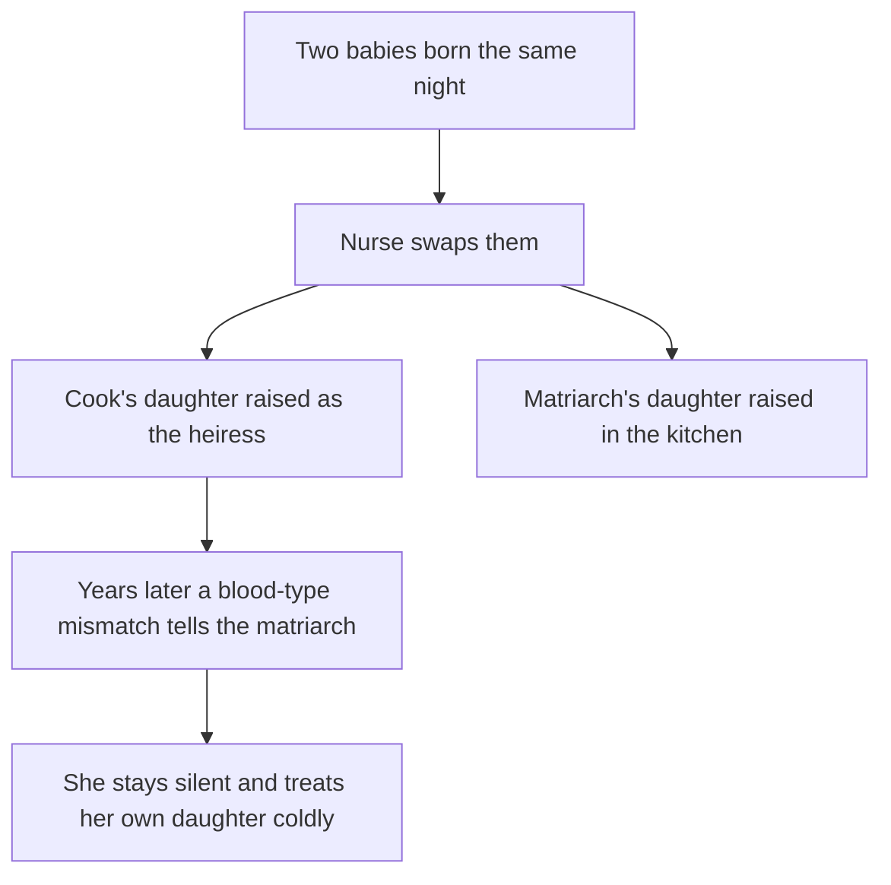

# Series Bible

Read [the entrypoint](../SKILL.md). Use this for a run of 6-10 connected episodes.
Write the bible first, lock it, then write each episode brief with
[the episode brief template](episode-brief.md). A bible is story material only; it
names no model, task or file.

## Template

```text
## <slug> — "<Series title>" (<main formula> + <supporting formula>)

Spine: For <audience>, show <central idea> so the viewer <intended reaction>.
Format: <N> episodes x <seconds> s (Hook / Turn / Cliffhanger), <aspect>.

Hidden truth (never stated before episode <N>): <what really happened, in order>.
Dramatic irony: <what the audience learns before the characters, and when>.

Cast (<=3 recurring + support): **<Name>** (<age>, <role>, <complexion and hair>,
<wardrobe>, always-worn: <items>, distinct from <other characters> by <3 cues>).
Locations (<=1-2 per episode): <name> — <layout, light>.

Ladder:
| # | Title | Hook | Turn (sampal or reveal) | Proof object | Cliffhanger question |

Open choices for the owner: <ending: closed or season cliffhanger>, <tone>, <purpose>.
```

## Rules

- **One spine, one hidden truth.** Every episode ends on a question that the
  ladder answers later; no question is answered before the episode that owns it.
- **Proof objects carry each reveal.** One object or mark per episode that a single
  close-up can show (will, lab envelope, bracelets, birthmark, cash envelope).
- **Reveal in two steps.** Reveal the fact about the father or the place first, then
  the fact about the mother or the motive, so the middle episodes keep climbing.
- **Give the villain a wound.** A kontrabida with a reason (fear, shame) lets the
  last episodes turn on a choice instead of a defeat.
- **Rewatch value.** Plan one early line or slap that changes meaning once the hidden
  truth is known.
- **Distinct cast.** Cast characters so each differs from the others in three of:
  hair silhouette, garment silhouette, dominant color, complexion. Spread complexions
  naturally (fair to brown) and keep every character appealing, older ones warm.
- **Reuse before you rebuild.** When an episode already exists, make it episode 1,
  keep its names and approved elements, and say so in the bible.
- **Element ledger.** End the bible with the characters, props and locations each
  episode needs, so canon can be generated once and reused.

## Worked example (shape only)



Ladder shape for ten episodes: 1 accusation and heir reveal; 2 the other daughter
arrives and an envelope is sealed until the 40th-day prayer; 3 the planted theft;
4 the night nurse and paired bracelets; 5 the envelope opened (father's result);
6 the birthmark finds the cook; 7 the matriarch's confession and cash offer;
8 the frame; 9 the two mothers; 10 the Don's letter and the daughters together.
