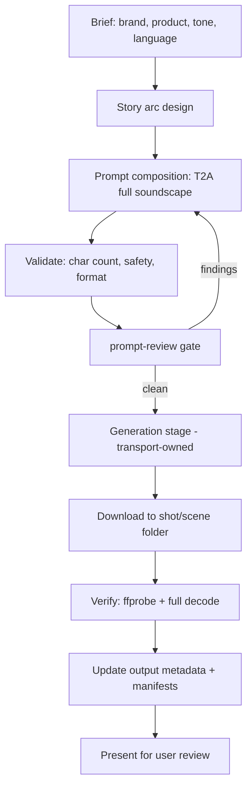

# Seed Audio Commercial

Produce dramatic, story-driven audio commercials using BytePlus Seed Audio 1.0
(`seed-audio-1.0`). This skill composes full-soundscape T2A (text-to-audio)
prompts that produce dialogue, background music, sound effects, and ambience in
a single generation pass — no separate mixing, scoring, or Foley required.

**Pairs with `seed-audio-prompt`** for Seed Audio prompt structure, voice
profile formatting, timestamp control, API limits, and pricing. This skill
specializes the commercial workflow: story arc design, commercial-specific SFX
and music patterns, multilingual safety filter guidance, cost management, and
the production lifecycle.


## Input and output contract

Input: brand, audience, language, cast, story objective, duration and authorized generation scope.

Output: a commercial soundscape prompt (the composition deliverable), then — through the separated generation stage — the prepared request, durable audio, and QA evidence.

## Procedure and reference loading

Prompt composition (Steps 1–4) is the core; the generation stage (Steps 5–8) is transport-owned and separated below. Add commercial-sound-patterns to design music/SFX and worked-examples for a relevant commercial pattern; examples do not change the requested language or approve a retry.

Read only the mode-specific resources needed for the request. Reference paths
mentioned in prose are relative to this skill directory unless a link says otherwise.

- [Commercial Sound Patterns](references/commercial-sound-patterns.md) — Commercial music direction patterns; SFX patterns for food commercials; Ambience transition patterns; Story arc template (5 acts).
- [Worked Examples](references/worked-examples.md) — Full example: Jollibee Chickenjoy (Taglish); Full example: Lola Maria's Ube Halaya (Taglish, 30s spot).

## Submission boundary and failure behavior

The caller owns production authorization, the exact request preflight, and the
complete hash-bound prompt review. A leaf returns its prompt package without
loading sibling skills. An explicitly declared orchestrator may coordinate the
review and submission stages. Missing required inputs remain unresolved; a draft
or technical success does not establish user approval. Preserve optional timing,
the three-image sampling default where applicable, and the requested delta.

## What this skill produces

A reviewed commercial soundscape prompt with:

- Full soundscape in one pass (dialogue + BGM + SFX + ambience)
- Multi-character voice profiles with distinct ages, accents, and emotions
- Dramatic story arc (setup → conflict → resolution → brand tagline)
- Music that shifts with the emotional beats of the story
- Chronologically interleaved SFX and ambience transitions
- Prompt snapshot, manifest, and verification metadata

After the composition passes review, the separated generation stage produces
the finished audio asset from it.

## When to use this skill

- "Create an audio commercial for [brand/product]"
- "Make a dramatic radio spot for [product]"
- "Generate a story-based audio ad with dialogue and music"
- "Produce a Filipino/Taglish commercial using Seed Audio"
- "Write and generate a multi-character narrative audio spot"
- "Make a brand commercial with emotional arc and tagline"

## When NOT to use

- **Plain TTS or single-voice narration** — use `seed-audio-prompt` directly
  without the commercial story structure.
- **Video generation** — use Seedance skills (`seedance-prompt-25` for 2.5,
  `seedance-prompt-20` for 2.0). If the dialogue track is for a Seedance video
  and the user has explicitly requested lip-synced audio, generate the audio
  first, verify `duration ≤ video_duration`, and pass it as `reference_audio`.
  When the user has not requested lip-synced audio, generate video directly
  and let Seedance's native audio handle dialogue.
- **Image generation** — use Seedream skills (`seedream-prompt`).
- **Voice cloning for consistent characters across multiple clips** — use
  `seed-audio-prompt` in TA2A mode with reference audio clips.

## Production workflow

Composition (Steps 1–4) is the core deliverable path; the generation stage
(Steps 5–8) is transport-owned and separated.



### Step 1 — Gather the brief

Collect or propose:

| Field | Example | Required |
|---|---|---|
| Brand | Jollibee | Yes |
| Product | Chickenjoy (crispy fried chicken) | Yes |
| Tone | dramatic, emotional, nostalgic | Yes |
| Language | English, Taglish, Spanish, etc. | Yes |
| Target duration | ~60–120s (max 120s per call) | Yes |
| Cast | 2–4 characters with voice profiles | Yes |
| Story hook | homesick worker, family reunion, etc. | Yes |
| Tagline / CTA | "Home is just one bite away" | Yes |
| Cultural context | Filipino OFW experience, etc. | If relevant |

### Step 2 — Design the story arc

A dramatic commercial needs a **five-act micro-story**:


| Act | Purpose | Audio character |
|---|---|---|
| **1 — Setup** | Establish the emotional state and environment | Melancholic / tense music, sparse ambience |
| **2 — Conflict** | Introduce the tension or longing | Music intensifies or shifts, dialogue escalates |
| **3 — Journey** | Character moves toward the product | Ambience transitions, footsteps, door sounds |
| **4 — Turn / Reveal** | The product triggers an emotional shift | Music transforms (sad → warm), SFX (crunch, pour, sizzle) |
| **5 — Resolution + Tagline** | Emotional resolution, brand voiceover | Bright/uplifting music, announcer delivers CTA |

**Rules:**
- Each act must have a **distinct audio state** (music mood, ambience, intensity).
- Transitions between acts must be tied to **observable events** (a door opening,
  a bite, a phone ring), not arbitrary cuts.
- The product must be the **trigger for the emotional turn** in Act 4.
- The tagline in Act 5 must connect the emotional story to the brand promise.

### Step 3 — Compose the T2A prompt

Assemble the prompt using the full-soundscape order shown in the template below
(scene and atmosphere, characters and dialogue, ending), arranged as one
chronological audio scene. Use this commercial template:

```text
Scene and atmosphere
Environment: [location, time, weather, acoustic space, emotional tone]
Background music: [dramatic role, genre, instruments, tempo, mood, dynamic arc
  tied to story beats, mix relationship to dialogue, ending behavior]
Ambience: [foreground, midground, background layers and how they evolve]

Characters and dialogue
[SFX or ambience that opens the scene]

[Character A] ([age, gender, accent, voice timbre, emotional baseline, delivery
  style]) says [delivery note]: "[dialogue]"

[Music/SFX/ambience change triggered by the line or action.]

[Character B] ([contrasting voice profile]) replies [delivery]: "[dialogue]"

[Continue interleaving dialogue, actions, SFX, and score changes in
chronological order through all five acts.]

[Character A] (internal voice-over, [delivery]) says, voice [emotion]:
  "[emotional peak dialogue]"

[The brand tagline from the announcer.]

Announcer ([deep/warm/confident, gender, broadcaster tone]) says with [tone]:
  "[Brand]. [Product qualities]. [Tagline / CTA]."

[The brand jingle plays its final bright notes and resolves cleanly.]

Ending
[Describe the final sound: music resolution, ambience tail, fade to silence.]
```

### Step 4 — Validate before generating

Check these constraints before handing the prompt to the generation stage:

| Check | Limit | Action if exceeded |
|---|---|---|
| `text_prompt` length | 3,000 characters | Trim redundant descriptions, shorten stage directions |
| Target duration | 120 seconds max per call | Split into multiple calls and chain via TA2A |
| Output format | MP3 at 24000 Hz recommended | WAV at 44100 Hz can exceed the 10 MB artifact limit |
| Non-English dialogue | Content safety filter may reject | See [Multilingual and Taglish guidance](SKILL.md#multilingual-and-taglish-guidance) |
| Reference audio | Not needed for T2A | Omit `audio_references` and all `<<TGT_SPKN>>` tags |

**Format recommendation**: Always use `mp3` at `24000` Hz for commercials. A
100-second WAV at 44100 Hz is ~18 MB and exceeds the 10 MB artifact store limit;
the same clip as MP3 at 24000 Hz is ~800 KB.

### Step 5 — Generate (generation stage, transport-owned)

Everything in this step belongs to the workspace transport, not to prompt
composition. Before calling the tool, write the immutable exact prompt snapshot
beside the planned output and record its SHA-256, ordered references,
parameters, model, operation ID, request hash, and `submission_status: prepared`
in `task_ids.json`. Obtain a complete prompt-review result for that exact
request. Persist each variation as its own operation before submission. Then
mark the operation `submitting` and call `seed_audio_generate` with the composed
prompt:

```python
seed_audio_generate(
    input={
        "text_prompt": <composed_prompt>,
        "output": {
            "format": "mp3",
            "sample_rate": 24000,
            "subtitle": True,
            "subtitle_type": "utterance"
        },
        "persist": True
    }
)
```

For multiple takes, use `seed_audio_generate_variations` with
`variation_prompts` (up to 5 parallel variations). Each variation is an
independent generation — partial failures are captured per variation.

**Timeouts**: A local timeout is unavailable completion evidence. Preserve the
prepared request and set `submission_status: submission_unknown` when acceptance
cannot be established. Record any provider task/request ID immediately. Reconcile
through provider status, artifact lookup, or support using the operation and
request evidence. With a known task ID, resume polling that task. Without an ID,
keep the operation unresolved; elapsed time does not establish non-acceptance.
Do not resubmit automatically or switch transport to repeat the request. A new
operation requires terminal/non-acceptance evidence or explicit user authorization
that acknowledges the unresolved prior request and duplicate-cost risk.

**Content safety rejections**: The provider runs an audio risk audit on the
generated output. If a chunk is rejected (`decision_in_reject_list`), the
entire generation fails with `code=55001310`. See
[Multilingual and Taglish guidance](SKILL.md#multilingual-and-taglish-guidance) for
mitigation strategies.

### Step 6 — Download and verify (generation stage)

After generation succeeds:

1. **Download** the audio from the `source_url` to the project asset path.
2. **Verify with ffprobe** — record duration, format, sample rate, channels,
   bit rate, and file size.
3. **Full decode check** — run `ffmpeg -v error -i <file> -f null -` to confirm
   no decode errors.
4. **SHA-256** — compute and record the hash; verify it matches the artifact
   record.
5. **Verify the prepared snapshot** — retain the pre-submission prompt file and
   confirm its SHA-256 still matches the request; add output metadata only.

### Step 7 — Save manifests (generation stage)

Create or update these project files:

| File | Purpose |
|---|---|
| `projects/<project>/project.md` | Brief, cast, locations, model defaults, status |
| `projects/<project>/scenes/scene-01/scene.md` | Scene definition, story, assets table |
| `projects/<project>/scenes/scene-01/s01_sh010/shot.md` | Generation details, output, cost, prompt ref, notes |
| `projects/<project>/scenes/scene-01/prompt_mix_s01_v<NN>.md` | Immutable prompt snapshot beside the audio asset |

The prompt snapshot lives **beside the media asset it produced, nowhere
else.** Use the `prompt_` prefix followed by the audio asset name (without
extension). For a scene-level commercial mix: `prompt_mix_s01_v01.md` beside
`mix_s01_v01.mp3`. For shot-level dialogue:
`prompt_dlg_s01_sh010_<character-id>_t01_v01.md` beside
`dlg_s01_sh010_<character-id>_t01_v01.mp3`.

### Step 8 — Present for review (generation stage)

Present the result to the user with:
- The local file path
- Duration and format
- The story arc summary (one line per act)
- Key dialogue lines
- Any issues encountered (safety filter, format, etc.)
- Cost estimate

Set the manifest `status` to `review`. Only explicit user approval sets it to
`approved`.

## Multilingual and Taglish guidance

Seed Audio supports multilingual synthesis. A moderation error is a provider
rejection, not proof that a language, phrase, or cultural term is unsafe or that
the classifier made a false positive. Save the provider code, request/task ID,
reported reason, and available evidence without inventing a cause.

Review the actual content and rights context. Correct a legitimate issue with a
recorded change contract, or use the provider's support/appeal path when the
reason is unclear. Preserve the user's requested language unless a translation
is explicitly requested or agreed. Rephrasing to disguise content or bypass a
filter is not a remediation strategy. A new authorized attempt gets a new
operation record, reviewed prompt snapshot, and cost estimate; no wording
promises a guaranteed pass.

## Cost management (generation stage)

| Parameter | Value |
|---|---|
| Model | `seed-audio-1.0` |
| Pricing | $0.15/min ($0.0025/second) |
| Billing basis | `original_duration` (pre-processed) |
| Max duration per call | 120 seconds |
| Typical 100s commercial | ~$0.25 |
| Typical 120s commercial | ~$0.30 |
| 3-take iteration | ~$0.75 |

**Cost-saving tips:**
- Prototype with shorter prompts first (60–80s) to validate the story arc
  before generating the full-length version.
- Use `seed_audio_generate_variations` for parallel takes — it's the same
  total cost as sequential calls but faster.
- Each content-safety rejection still bills for the generation attempt (the
  audio is generated before the audit rejects it). Validate multilingual
  prompts carefully before submitting.
- Set `DAILY_BUDGET_USD` on the MCP server to enforce a hard daily limit.
