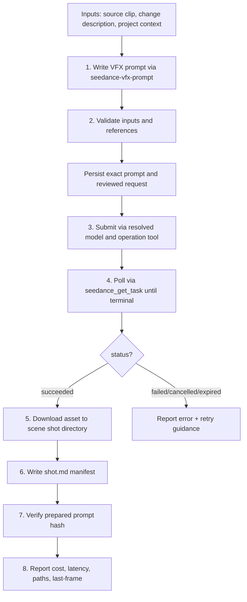

# Seedance VFX Pipeline

End-to-end pipeline for producing a Seedance VFX shot from a source clip
(default Seedance 2.5; use 2.0 only for 4K output or Fast/Mini variants).
This skill composes the `seedance-vfx-prompt` skill (prompt writing) with the
`ark-mcp` tools (task submission, polling, download) to produce a saved,
manifested asset following the workspace's `projects/<project>/` directory
conventions. This is an explicitly declared orchestrator.

Initialize or resume the project `showcase.json`/`index.html` canvas before the
run. Keep the source clip, exact prompt, references, before/after outputs,
comparison render, QA, task provenance and selection state together in the
appropriate `shot-generation` section. Regenerate the canvas after each material
change and pass `--check --stage shot-generation` before reporting the shot stage
complete.

> **Version note**: This pipeline runs on **both** Seedance generations.
> **Default to Seedance 2.5** (`dreamina-seedance-2-5-260628`,
> `omni_reference_task_type=edit`) for full-duration edits — 2.5 preserves ~the
> source length, while **2.0's `edit_video` caps output at ~5s** in practice.
> Use 2.0 only for 4K output or Fast/Mini variants. For 2.0 T2V/R2V prompts,
> use `seedance-prompt-20`.

Use this skill when the user wants to:
- **run a complete VFX shot** from source clip to saved output
- **submit a VFX edit** to Seedance and get the result back as a local file
- **produce a manifested, reproducible VFX asset** with `shot.md` + prompt file
- **swap one object or recast a whole clip** (Object Swap or Motion Transfer)
  through the same reviewed submission and delivery gates
- **produce batch variants** of one approved take for markets, talent or products

Do **not** use this skill when the user only wants to:
- write a VFX prompt without submitting (see `seedance-vfx-prompt`)
- generate text-to-video or image-to-video (see `seedance-prompt-25`; `seedance-prompt-20` for 4K/Fast/Mini)
- generate images or audio (use Seedream / Seed Audio skills)


## Input and output contract

Input: source footage, approved change contract, output path, selected model/mode, and generation authorization.

Output: a prepared operation, durable output, manifest, and technical/semantic review.

## Procedure and reference loading

Resolve inputs and preflight below first. Read submission before any provider call, delivery-and-manifest after acceptance, and shot-chaining only for a requested multi-shot continuation. Read recast-and-variants first for an Object Swap, a Motion Transfer recast, or batch variants.

Read only the mode-specific resources needed for the request. Reference paths
mentioned in prose are relative to this skill directory unless a link says otherwise.

- [Submission](references/submission.md) — Step 3 — Submit via MCP; Step 4 — Poll for completion.
- [Delivery And Manifest](references/delivery-and-manifest.md) — Step 5 — Download and save the asset; Step 6 — Write the shot.md manifest; Step 7 — Verify the prepared standalone prompt file; Step 8 — Report results.
- [Shot Chaining](references/shot-chaining.md) — Shot chaining workflow.
- [Recast And Variants](references/recast-and-variants.md) — route selection (VFX edit, Object Swap, Motion Transfer), shared subject map, batch variant rows, parallel execution, cost preview, real-person gates, and recast QA. Read before prompt writing for any swap, recast, or multi-variant request.

## Submission boundary and failure behavior

The caller owns production authorization, the exact request preflight, and the
complete hash-bound prompt review. A leaf returns its prompt package without
loading sibling skills. An explicitly declared orchestrator may coordinate the
review and submission stages. Missing required inputs remain unresolved; a draft
or technical success does not establish user approval. Preserve optional timing,
the three-image sampling default where applicable, and the requested delta.

## Prerequisites

- `ARK_API_KEY` (or `BYTEPLUS_MODELARK_API_KEY`) set in environment or `.env`
- `ark-mcp` MCP server running and healthy
- Source video clip accessible as a local file path or URL
- Project directory exists under `projects/<project-name>/`

## Pipeline overview



Route selection precedes Step 1. A VFX edit or Object Swap takes its prompt from
`seedance-vfx-prompt` and submits as an edit; a Motion Transfer recast takes its
prompt from `seedance-motion-recast` and submits on the provisional motion
reference route or its full-frame edit fallback. Object Swap and Motion Transfer
first run `source-subject-map` once per source. Batch variants repeat Steps 1–8
per variant row, with a 480p key-beat probe before each final, a side-by-side
against the source, and a canvas entry per row. This orchestrator owns that
sequencing; see [Recast And Variants](references/recast-and-variants.md).

## Before/after demo recipe (turnkey)

The workspace's recurring pattern for a text-only before/after VFX demo:

1. BEFORE — Seedance 2.5 T2V, `720p`, `16:9`, natural duration (4–30s), no
   references. Save + manifest.
2. `media_upload` the BEFORE clip; record its `object_key` in the project
   `ref_cache.json` with content SHA-256 and storage scope. Re-presign unchanged
   objects on demand; re-upload only for changed content or a missing object.
3. AFTER — `seedance_2_5_create_task`, `omni_reference_task_type=edit`, `1080p`,
   `@Video 1` = the BEFORE URL; `duration` and `ratio` auto-lock. Write the
   prompt with `seedance-vfx-prompt` (2.5 editing section).
4. Transcode the AFTER (usually HEVC) to H.264 for review/Lark — see the
   "Delivery transcode" recipe in Step 5. Keep the HEVC master.
5. Comparison — if the halves differ mainly in audio (language swap / dialogue
   rewrite), use the staggered one-at-a-time split from
   `ffmpeg-side-by-side-comparison`; otherwise a simultaneous `hstack`.
6. Canvas and manifests — complete Steps 6–7, add the source, prompt, outputs,
   comparison and QA to the project canvas, regenerate/open it, and pass the
   `shot-generation` freshness check. Then set `review`; a passing temporal
   review and mode-authorized, hash-bound decision may set `approved`.

## Inputs

| Input | Required | Description |
|---|---|---|
| `source_video` | Yes | Local path or URL to the source clip to edit |
| `change_description` | Yes | Plain-language description of the VFX change |
| `project` | Yes | Project name (kebab-case, must exist under `projects/`) |
| `scene` | Yes | Scene ID (e.g. `scene-01`) |
| `shot` | Yes | Shot ID (e.g. `s01_sh010`) |
| `element_refs` | No | List of element reference paths (characters, locations, props) |
| `resolution` | No | Lowest suitable supported value; normally 720p prototype, 1080p final on 2.5; 4K only on a supported selected legacy path |
| `duration` | No | For 2.5 edit, validate source length and omit auto-locked duration; legacy limits require live operation evidence |
| `ratio` | No | Inherit the source in edit modes where ratio auto-locks; use supported explicit values only |
| `return_last_frame` | No | Default `true` (enables shot chaining) |
| `safety_identifier` | No | Default `<project>-<scene>-<shot>` |

## Step 1 — Write the VFX prompt

Compose the prompt with `seedance-vfx-prompt` after resolving the model and
operation. The default 2.5 edit uses its structured edit-goal grammar. The
legacy 2.0 branch uses the following natural-language heading structure:

```text
Asset preparation:
@Video 1: source clip — [subject, action, camera motion, duration]
@Image 1: [element reference] — [role]

Subject definitions:
Define the [features] in @Video 1 as [Label]

Prompt:
Task type: Video Editing
Strictly edit @Video 1, and modify [what changes] at [timestamp]. Preserve [locks].

[New world — full description of the replacement or added environment/element]

Lighting: [embedded lighting]
Space: [foreground, midground, background depth]
Timing: [if applicable]
Audio: [diegetic only]

Quality and constraints:
Quality: photoreal, [look/grade], [observable detail criteria]
Constraints: [NON-IP, face protection, no-warp, camera-motion lock]
```

Pass the user's `change_description` to the prompt skill. The prompt skill will
produce the structured prompt text.

## Step 2 — Validate inputs

Before submitting, verify:

1. **Source video exists** — confirm the local file path resolves or the URL
   is reachable. If local, note the file size (large base64 uploads compete for
   bandwidth; the MCP server handles encoding).
2. **Element references exist** — for each path in `element_refs`, confirm the
   file exists under `projects/<project>/elements/`. Each reference should be
   a character sheet, location sheet, or prop sheet image.
3. **Prompt is complete** — use the selected model/operation checklist.
   Apply 2.5 edit-goal grammar to 2.5 edits and legacy heading rules only to
   the legacy path. Include observable face-fidelity criteria when relevant.
4. **Model and operation** — resolve the model, transport tool, edit operation,
   and reference mode before choosing a checklist. Default 2.5 edit uses
   `seedance_2_5_create_task` with `omni_reference_task_type: edit`; 4K requires
   an explicitly chosen legacy path supported by live tool evidence. Faces
   require fidelity QA, not a model switch.
5. **Duration and mode compatibility** — for 2.5 edit, validate source length
   against live edit limits and omit auto-locked `duration` and `ratio` fields.
   On a 2.0 path, validate its operation-specific limits. A generation maximum
   is not evidence of edit support. Mixed first/last-frame and reference bundles
   require explicit capability evidence even when chaining is requested.


6. **Project/scene/shot directory exists** — create it if missing:
   - `projects/<project>/scenes/scene-NN/sNN_shNNN/`

## Error handling

| Error | Cause | Action |
|---|---|---|
| Content safety rejection | Provider rejected the request or output | Preserve code/reason and request/task evidence; review actual content and rights, then make a legitimate reviewed revision or seek provider support |
| `OutputVideoSensitiveContentDetected.PolicyViolation` | Provider-reported policy rejection; cause may be unknown | Record the exact evidence without presuming a false positive; use support/appeal or a legitimate content correction, not wording intended to evade the filter |
| `resource download failed` (`InvalidParameter` on the video reference) | Presigned reference URL expired or a transient fetch failure | Call `media_presign` with the recorded `object_key` for a fresh URL and resubmit |
| Invalid reference format | Video URL unreachable, image not valid PNG/JPEG | Verify file paths; re-encode images as PNG; use `kind: "base64"` for local files |
| Prompt too long | Exceeds 32,000 character limit (the MCP `seedance_create_task` video-generation tool accepts up to 32,000 characters) | Condense `New world:` and `Lighting:` sections; remove redundant detail |
| Local timeout / unknown acceptance | Completion or acceptance is unresolved | Retain `submission_unknown`; reconcile the same request, poll its known task ID, and never automatically resubmit |
| Provider terminal expired | Provider confirms expiration | Record terminal evidence; any authorized new take gets a new prepared operation and reviewed request |
| Face warp in output | Observed fidelity defect; cause unresolved | Review source detail, motion, references, and locks; record one requested delta and select a supported resolution for any authorized new take |
| Camera motion drift | Camera lock too vague in `Locks:` | Specify exact motion type (handheld bob, lateral sway, tracking speed) and add "frame-for-frame" lock; resubmit |

Always surface the `task_id` in error reports — it is the reference for support
and debugging.

## Cost considerations

VFX shots using Seedance 2.0 at 4K with audio are the **most expensive**
generation mode in the workspace. Each 4K VFX take costs significantly more than
a 1080p text-to-video take.

Seedance 2.5 at 720p is cheaper per generation but cannot produce 4K output — use 2.5 for structured editing and extension, 2.0 when a supported 4K output path is explicitly needed.

Guidelines:
- **Default to a single take** (`t01`) for VFX development. Generate multiple
  takes only for final selection.
- **Use a supported variation tool for the resolved model/operation** when the user
  requests multiple takes and current capability evidence supports that model,
  operation, and resolution. Prepare and track each variation independently;
  choose concurrency within the transport limits and authorized budget.
- **Never submit 4K VFX shots without explicit user confirmation** of the cost.
  State the expected per-take cost before submitting.
- **Cache and reuse** — if a take is approved, mark `status: approved` in the
  manifest. Do not regenerate approved takes.

## Pipeline checklist

Before declaring a VFX shot complete, verify:

- [ ] **Prompt reviewed** — 2.5 edit-goal grammar and checklist for 2.5 edits;
      legacy natural-language headings/checklist only for the supported 2.0 branch.
      The complete review is bound to the exact prepared request hash.
- [ ] **Supported model/mode/resolution** — face/detail fidelity included in QA
- [ ] **Chaining inputs** — requested last-frame output and the next shot
      reference roles are supported by the selected model/operation.
- [ ] **Audio mode** — matches the request and uses only supported parameters.
- [ ] **Task submitted** — the resolved tool acknowledged a task ID: normally
      `seedance_2_5_create_task` for 2.5 edit; the verified legacy tool for 2.0.
- [ ] **Task polled** — `seedance_get_task` returned `status: succeeded`
- [ ] **Video saved locally** — asset in `scenes/scene-NN/sNN_shNNN/`
- [ ] **Last frame saved** — PNG alongside the video (if chaining)
- [ ] **`shot.md` manifest written** — full YAML frontmatter with model, prompt
      references, seed, params, cost, status, artifacts
- [ ] **Prepared prompt verified** — the immutable `prompt_...md` snapshot was
      saved before submission beside the planned output and its hash still
      matches the request and `shot.md`.
- [ ] **Cost recorded** — estimated cost, confirmed billing, and provider usage
      remain separate; unavailable fields are recorded as unavailable.
- [ ] **Status set** — technical success enters `review`; a mode-authorized,
      hash-bound decision records `approved` or `rejected` after actual QA.
- [ ] **No secrets in manifest** — API keys, tokens, credentials never in
      frontmatter or prompt files
