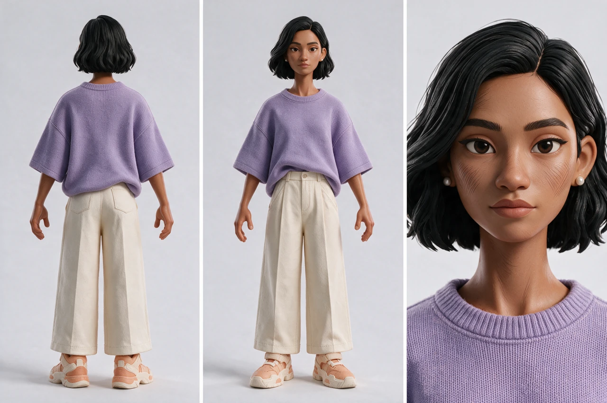
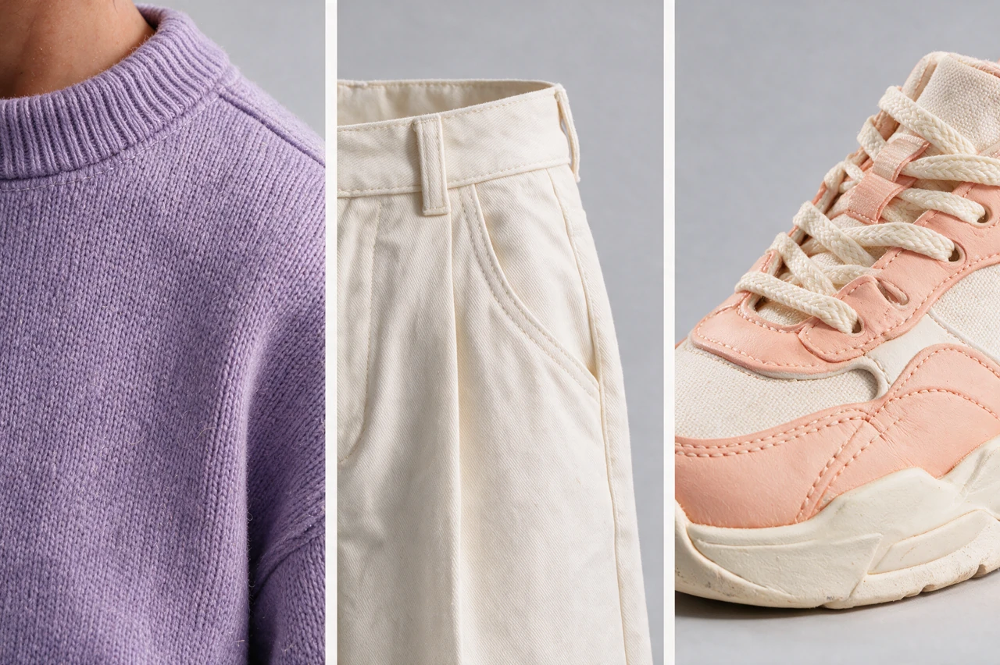
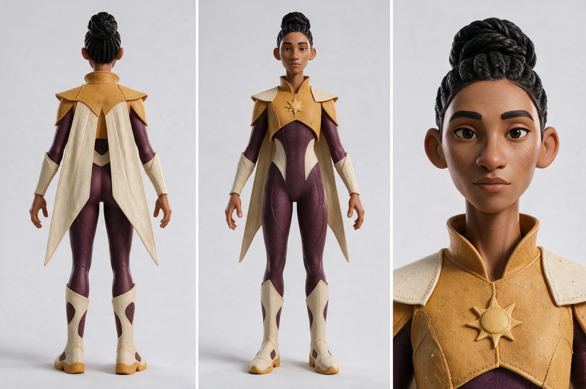
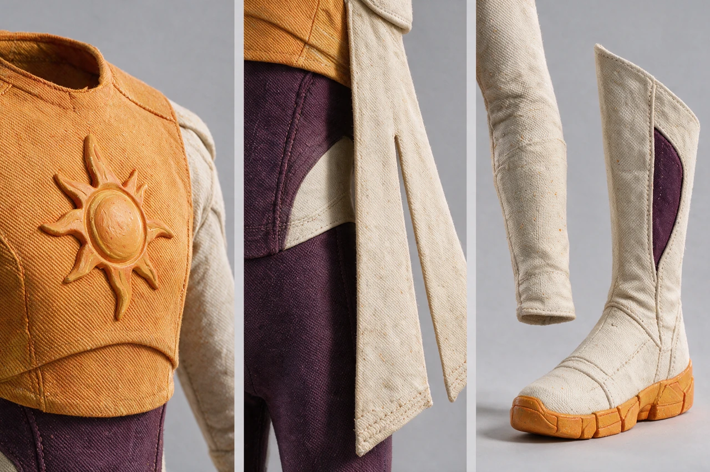
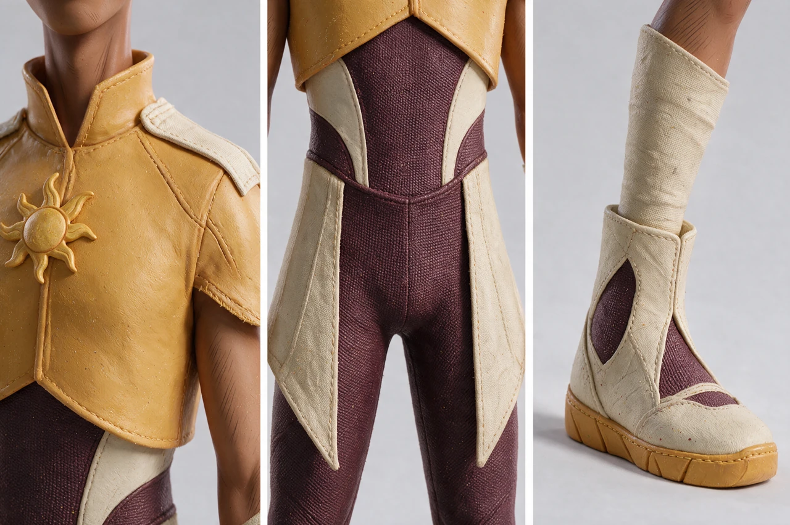

# Reviewed examples

These original characters were generated with Seedream 5.0 Pro on 2026-10-10.
Each image below is a resized WebP review preview, not the full-resolution PNG.
The unchanged historical prompts are included beside them. Inspect
[provenance.json](provenance.json) for the model, effective parameters, source
and preview hashes, artifact IDs, and observed limitations.

The two style-only input images are not distributed. These snapshots document
actual requests; they are not standalone reproducible input packages. When
adapting them, supply authorized references and rewrite their roles explicitly.
Do not treat a historical model binding or size as a current API requirement.

## Everyday character: Amara

The lavender shirt, ivory trousers, sculpted bob, matte skin, and fine hatching
demonstrate the visual treatment. The selected full-body views retain footwear
and a neutral face anchor.

Exact prompt: [character sheet](prompt_char_amara_sheet_v01.md).

Exact prompt: [material study](prompt_char_amara_materials_v01.md).

**Observed limit:** the independent macro sneaker uses laces while the sheet
uses broad strap-like closures. The palette and texture agree; the sheet
governs exact shoe geometry. This is a styling study, not a fabrication drawing.

## Original superhero: Sinag

The marigold jacket, aubergine suit, cream gauntlets, tall boots, abstract sun
relief, and split cape show how the same treatment supports a new superhero.
The selected result has taller boots and longer cape tails than the initial
prompt proposed. Those creative variations were accepted after inspection;
future costume prompts should describe the visible selected sheet.

Exact prompt: [character sheet](prompt_char_sinag_sheet_v01.md).

Exact prompt: [corrected material study](prompt_char_sinag_materials_v02.json).
This snapshot stores the exact text in its `prompt` JSON string to retain the
original whitespace; decode that field before reuse.

**Observed limit:** collar, sun-ray relief, and boot construction vary slightly
between sheet and macro. The selected macro contains costume surfaces only;
the character sheet remains authoritative for identity and costume geometry.

## Framing pitfall and correction

The first material prompt used a crop "below the chin" but left a visible
lower-face fragment. It also included unnecessary face and skin descriptors.

Exact prompt: [original material study](prompt_char_sinag_materials_v01.md).

The correction omitted face/hair style descriptors, requested costume surfaces
on invisible supports, and described cloth filling the upper frame edge. The
selected new sample excludes face and skin. This comparison demonstrates an
observed correction, not a controlled experiment or a guarantee for future
samples. Inspect every generated candidate before calling the framing fixed.
