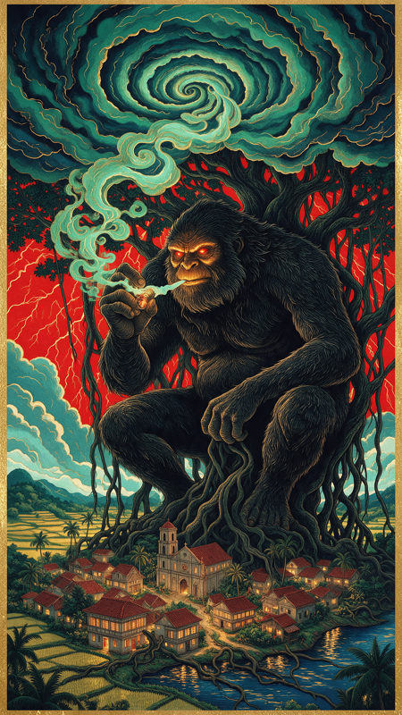
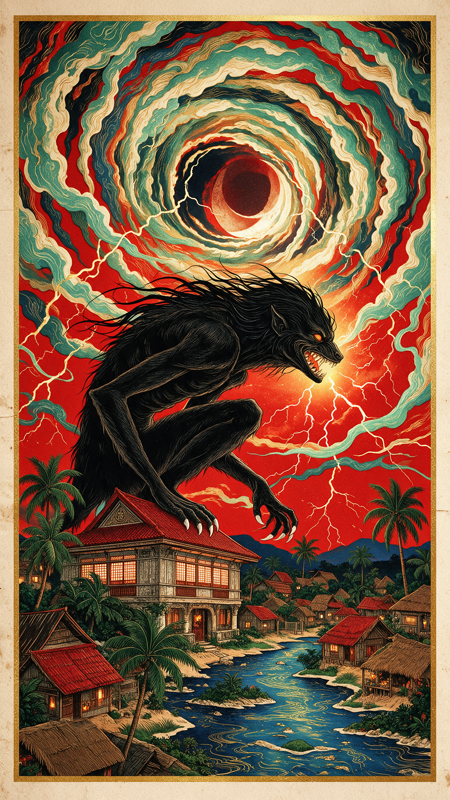
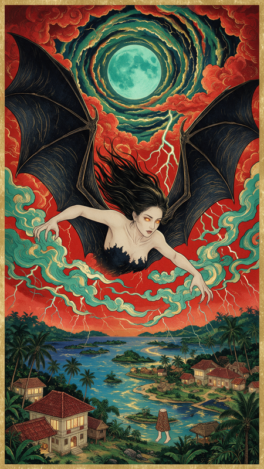
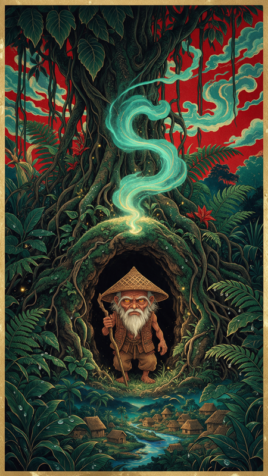
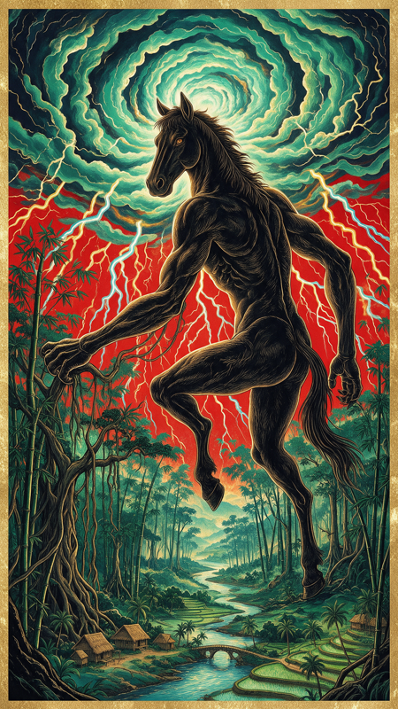
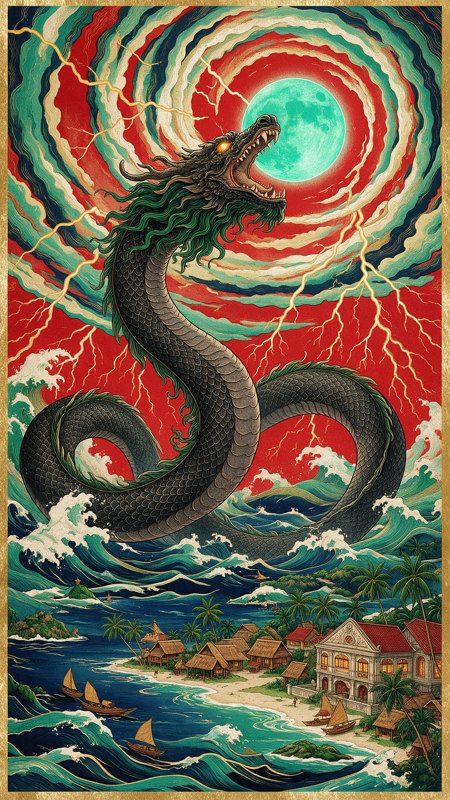

# Observed Philippine folklore posters

**Six separate Seedream 5.0 Pro images**, generated on 2026-10-10 with one shared style-only reference. These PNG images are resized previews. Exact submitted prompts are unchanged; [provenance](provenance.json) records source and preview hashes.

The style reference is not distributed. Supply your own reference and update the image binding when adapting these examples. Model and dimensions are historical observations, not live API requirements. Creatures are artistic interpretations. Dense ornament can obscure fine hand and facial detail; inspect anatomy and thumbnail legibility before selection. The results demonstrate a shared palette and print treatment, not exact correspondence to every prompt detail.

## Kapre

Exact submitted prompt: [Kapre](prompt_concept_kapre_v01.md).

## Aswang

Exact submitted prompt: [Aswang](prompt_concept_aswang_v01.md).

## Manananggal

Exact submitted prompt: [Manananggal](prompt_concept_manananggal_v01.md).

## Dwende

Exact submitted prompt: [Dwende](prompt_concept_dwende_v01.md).

## Tikbalang

Exact submitted prompt: [Tikbalang](prompt_concept_tikbalang_v01.md).

## Bakunawa

Exact submitted prompt: [Bakunawa](prompt_concept_bakunawa_v01.md).
