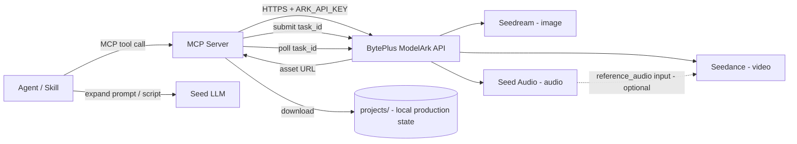

# ark-director

> An AI director workspace that combines deterministic HTML-entrypoint graphics with project-local CSS/SVG dependencies and BytePlus / Volcano Engine generative models — **Seedance** (video), **Seedream** (images), and **Seed Audio** (audio) — to turn prompts and references into finished content assets.

> Pair this workspace with the partner [`byteplus-sa/modelark-mcp`](https://github.com/byteplus-sa/modelark-mcp) server and consult the [ModelArk console docs](https://console.byteplus.com/ark/region:ap-southeast-1/docs/ModelArk/2536875?lang=en) to maximize capabilities.

`ark-director` behaves like an "AI director": it composes multiple BytePlus model families into end-to-end content pipelines. The primary integration mechanism is **MCP (Model Context Protocol) servers** plus **agent skills**:

- **MCP servers** wrap the BytePlus ModelArk REST API and expose narrowly-scoped, composable tools.
- **Agent skills** are higher-level content-creation recipes that compose those MCP tools into end-to-end pipelines (e.g. "short ad spot", "storyboard to video", "podcast intro").

Agents prefer MCP for durable generation and Ark CLI for platform administration or interactive generation. Equivalent CLI fallback preserves the same review, persistence, and reconciliation contract. Skills never call the Ark REST API directly.

---

## Model catalog

Models are accessed through **BytePlus ModelArk** and the BytePlus Seed Speech surface. Credentials are resolved from the environment at runtime: `BYTEPLUS_MODELARK_API_KEY` for Seedream and Seedance, and `BYTEPLUS_SEED_AUDIO_API_KEY` for Seed Audio.

| Family | Model(s) | Modality | Key capabilities |
|---|---|---|---|
| Seedance | **Seedance 2.5** (`dreamina-seedance-2-5-260628`, default) — up to 30s/pass, 1080p, 30 imgs / 10 vids / 10 audio refs. Seedance 2.0 (`dreamina-seedance-2-0-260128`) as fallback for 4K / Fast / Mini. | Video | Text-to-video, first/last-frame, multimodal references, editing, extension, native audio+video |
| Seedream | Seedream 5.0 Pro (`dola-seedream-5-0-pro-260628`); configured Lite/4.x bindings | Image | Text-to-image, reference-based generation/editing, multi-reference fusion, sequential output |
| Seed Audio | Seed Audio 1.0 (`seed-audio-1.0`) | Audio | Voice + music + SFX + ambience in one pass, multi-character dialogue, voice references, cross-lingual generation |
| Seed / Doubao | `seed-2-0-lite-260228` and siblings | Text | Prompt expansion, scene scripting, structured output |

---

## Architecture



- MCP tools submit an Ark task, poll until completion, download the resulting asset to the relevant `projects/<project>/scenes/...` path, and return both the local file path and the asset URL.
- **Always save generated files locally.** Element assets live under `elements/`, shot outputs under `scenes/`, and reusable non-shot media under `library/`. Provider URIs supplement the local copy.
- The Seed LLM is used inside skills for prompt expansion and scene scripting, not as a content generator itself.

---

## Directory structure

```
ai-director/
  AGENTS.md                         # workspace contract for agents and contributors
  skills-lock.json                  # registry of installed/vendored skills
  .agents/skills/                   # project-authored + vendored skills
  docs/                             # architecture guides, model references, how-tos
  plans/                            # implementation plans (PLAN_*.md)
  specs/                            # exploratory specifications (SPEC_*.md)
  projects/                         # local-only production state (never committed)
    <project-name>/
      project.md                    # brief, cast, locations, model & credit defaults, status
      task_ids.json                 # provider task ID registry
      ref_cache.json                # uploaded reference object-key registry
      library/                      # reusable music, SFX, ambience
      elements/                     # canonical characters, locations, props
        <element-id>/
          character.md | location.md | prop.md
          ref_01_*.png               # reference seed images
          char_*_v01.png             # character / location / prop sheets
          prompt_*.md               # immutable prompt snapshots
      scenes/
        scene-NN/
          scene.md                  # script, cast, location, camera, style
          sNN_shNNN/                # shot folder
            shot.md                 # shot prompt, refs, model, params, seed, cost
            sNN_shNNN_tNN_vNN.mp4   # video take
            prompt_*.md             # immutable prompt snapshot
```

**Naming conventions:** lowercase kebab-case for all folders and ids. Structured token prefixes (`s01_sh010_t01_v01.mp4`, `char_gloria_turnaround_v01.png`) make generated files self-describing, sortable, and parseable.

---

## Production workflow

`ark-director` treats expensive media generation as a gated production workflow:

1. **Brief & creative locks** — record approved identities, environments, props, tone, resolution, duration, audio mode.
2. **Reference preflight** — classify each asset (visible identity, environment, motion reference, control-only). The ordered reference array submitted must match the `references:` list in `shot.md` exactly.
3. **Spatial & temporal preflight** — record start, travel axis, subject order, boundary behavior, end state for movement-heavy scenes.
4. **Audio for dialogue (optional)** — when the user requests lip-synced dialogue, generate the Seed Audio track first, then use it as `reference_audio` to Seedance.
5. **Low-cost prototype** — validate motion, geography, camera at the lowest suitable resolution.
6. **Creative review** — preserve approved decisions; write the single requested delta plus acceptance criteria for the next take.
7. **Final candidate** — increase resolution only after creative behavior is approved.
8. **Technical & semantic QA** — inspect actual streams, decode integrity, contact sheets, key transitions, audio.

**Generate per scene at its natural duration (4–30s), not per 30-second block.** Chain approved scenes via `return_last_frame` / `first_frame` + a shared reference bundle and assemble in post.

---

## Production rules

Draft breakdown identifies required canon. Approve recurring, branded, or story-critical references before dependent generation. Static sheets use visible-design checks; narrative shots use action and intent. Exact typography, UI, posters, prices, CTAs, logos, and product layouts use a deterministic HTML entrypoint with local CSS/SVG dependencies; Seedream remains the route for synthesized photography and illustration. Hybrid graphics select the image layer first and finish exact copy/layout deterministically.

Only explicit user choice selects or approves an asset. Freeze exact requests before submission, retain provider IDs, and reconcile unknown acceptance rather than retrying automatically. Default generative-image selection sets retain three equivalent stochastic samples; deterministic graphics produce one exact render per version.

The tracked [production policy](.agents/contracts/production-policy.md), [routing](.agents/contracts/routing.md), [element contract](.agents/contracts/element-identification.md), and [naming rules](.agents/contracts/asset-naming.md) contain the operational details. Root [AGENTS.md](AGENTS.md) is the entrypoint.

---

## Getting started

### Prerequisites

- An AI coding agent runtime that supports MCP servers and agent skills (e.g. [opencode](https://opencode.ai), Claude Code, or similar).
- A BytePlus ModelArk account with API access.
- Environment variables:

```bash
BYTEPLUS_MODELARK_API_KEY=your_modelark_key      # Seedream + Seedance
BYTEPLUS_SEED_AUDIO_API_KEY=your_seed_audio_key  # Seed Audio
# Optional: region override (default: ap-southeast-1)
# ARK_BASE_URL=https://ark.ap-southeast.bytepluses.com/api/v3
```

### Quick start

1. **Clone the repo** and open it in your agent-compatible editor.
2. **Set the environment variables** above in a `.env` file (gitignored).
3. **Start a project and its canvas** — create `projects/<your-project>/project.md`, the eight-stage `showcase.json`, and generated `index.html`.
4. **Break into scenes and shots** — write `scene.md` and `shot.md` manifests and update the canvas inventory.
5. **Build Elements** — acquire authorized real brand/product assets, use `html-graphic-render` for exact static graphics, and use the `seedream-*` skills for synthesized character, location, prop, or illustrative sheets; add source/provenance and review state to the canvas.
6. **Generate** — use the `seedance-*` and `seed-audio-*` skills to author prompts, then submit via the MCP tools.
7. **Assemble** — use the `ffmpeg-*` skills to concatenate approved takes with crossfades and mix audio.
8. **Review throughout** — after every stage, update and regenerate the same `showcase-html` production canvas, open it in-browser, and pass `--check --stage <stage-id>`. Use `--quick` only for ad-hoc files outside a tracked project.

---

## Skills

The workspace ships with **60 skills** across 14 categories. Independent skills package creative and tooling capabilities; declared orchestrators compose them. Installed bundles and operational contracts ship with the repository.

### Production Orchestration

| Skill | Description |
|---|---|
| **film-production** | Orchestrates multi-scene, multi-modality production one stage at a time while keeping a required HTML production canvas synchronized for review and handoff. |
| **template-factory** | Reverse-engineer a reference video with watchable-media analysis, download-first brand/product assets, deterministic exact graphics, and a synchronized production canvas. |
| **brief-intake** | Shape intent-led briefs and treatments; hand off brand-ad / footage inspiration for watchable-media analysis; preserve confirmed decisions. |
| **prompt-review** | Review and fix prompts written for BytePlus generative models (Seedance, Seed Audio, Seedream) against the repo's skill best practices using a sub-agent review pipeline. |
| **media-review** | Emergency OS-player fallback when the required HTML/browser review surface is unavailable. |
| **blender-to-seedance** | End-to-end pipeline that turns a Blender blockout into a Seedance 2.5 video. |

### Deterministic Graphics

| Skill | Description |
|---|---|
| **html-graphic-render** | Author and render exact-size static posters, cards, product grids, UI, and transparent overlays from one project-local HTML entrypoint with CSS/SVG dependencies, exact-copy checks, and schema-valid provenance. |

### Seedance — Video Prompting

| Skill | Description |
|---|---|
| **seedance-prompt-25** | Write production-grade Seedance 2.5 video prompts with the flexible six-part formula, 50-material multimodal referencing, variable-duration scene staging (4-30s), timestamp pacing, structured video editing (subject replacement, background replacement, audio editing), forward and backward video extension, keyframe sequences, storyboard grids,. |
| **seedance-prompt-20** | Legacy Seedance 2.0 prompt skill. Use when you need 4K output (unsupported by 2.5), Fast/Mini speed variants, or lower cost per generation. Provides reference-role classification, subject definitions, spatial continuity, shot sequencing, and native audio direction. |
| **seedance-prompt-25-filipino** | Write Filipino and Taglish dialogue direction while preserving exact words and register; use evidence-based pronunciation hypotheses and opt-in separate lip-sync audio. |
| **seedance-camera-presets** | Turns a named camera move (dolly, pan, tilt, orbit, crane, tracking, handheld, FPV, aerial, bullet time, dolly zoom, crash zoom, whip pan, one-take, static) into a canonical, drop-in Camera block for the six-part prompt formula. |
| **seedance-lens-presets** | Translates a lens, focal length, aperture, or sensor request into a canonical visible-result phrase for Seedance prompts or Seedream style. Covers 35mm, 50mm, 85mm, wide angle, telephoto, anamorphic, fisheye, macro, f-stop, depth of field, bokeh. |
| **seedance-lighting-presets** | Translates a named lighting setup (rim light, backlight, golden hour, soft/hard light, three-point, Rembrandt, practical lights, silhouette, contre-jour) into a canonical Seedream `Lighting:` recipe and a matching Seedance visual-style lighting phrase. Ensures the same lighting intent works for both images and video. |
| **seedance-pacing-presets** | Turns a named pacing or rhythm preset (speed ramp, slow motion, bullet time, ramp up, flash in/out, impact moment, montage, cut rhythm, speed up) into a canonical, timestamped motion, cut, and pacing block for the Seedance prompt. |
| **seedance-acting-console** | Turn playable motives and tactics into observable acting cues appropriate to framing, visibility and intensity. |
| **seedance-animation-styles** | Writes Seedance animation prompts for claymation, needle felt, wood puppets, toy miniatures, vintage rubber hose, painterly 2D, cubist ink, stylized 3D, silicone creatures, wax crayon, and custom animation media. Preserves handcrafted texture and material-specific motion. |
| **seedance-motion-design** | Write Seedance 2.5 motion-design prompts while routing exact typography and UI to deterministic post graphics and synthesized visual layers to Seedream. |
| **seedance-music-video** | Develop track-informed music-video treatments with intentional escalation, restraint, repetition or counterpoint and optional evidence-based synchronization. |
| **seedance-graybox-world** | Writes Seedance 2.5 prompts for the Blender gray look — an untextured gray graybox/blockout 3D world with matcap-style shading, ambient-occlusion depth, and a neutral gray viewport background, like Blender's Solid viewport. Use when gray IS the desired final look, not just a previs reference. |
| **seedance-restoration** | Write Seedance 2.5 video-to-video restoration prompts that remove film grain, noise, scratch lines, dust, and flicker from aged or archival footage while preserving the shot. |

### Seedance — VFX

| Skill | Description |
|---|---|
| **seedance-vfx-prompt** | Write structured or compact Seedance 2.0 video-to-video VFX prompts using the @Video N / @Image N reference grammar (or the compact @source / @creature shorthand), the three-level VFX taxonomy (world swap, element change, handheld cinematic showcase), embedded lighting with preserve-vs-relight integration recipe, layered space, timing triggers,. |
| **seedance-vfx-pipeline** | Run a complete Seedance video-to-video VFX shot and keep its source, prompt, outputs, comparison, and QA synchronized in the project canvas. |

### Seedream — Image Prompting

| Skill | Description |
|---|---|
| **seedream-prompt** | Write Seedream prompts for synthesized or edited imagery while routing exact typography, pricing, CTA, product grids, logos, and pixel layouts to deterministic graphics. |
| **seedream-character-sheet** | Writes structured Seedream prompts for three-panel character sheets and identity references. Produces the canonical character turnarounds that Seedance uses as face anchors. |
| **seedream-character-sheet-cleanup** | Cleans Seedream character sheets by removing the head from the full-body panels so only the close-up panel keeps a readable face. |
| **seedream-location-asset** | Writes structured Seedream prompts for cinematic location assets and reusable environment sheets. Use for creating locations, interiors, exteriors, set references, or establishing stills. |
| **seedream-storyboard** | Create, revise, and optionally generate production-ready cinematic storyboards—from one hero panel with alternatives to a multi-panel continuity sequence—with BytePlus Seedream. |
| **seedream-edit** | Guide for using the `seedream_edit_image` MCP tool for interactive image editing with Seedream 5.0 Pro. Use for point-based and bounding-box precision editing — replace objects, change regions, add elements at specific positions. |

### Color & Look

| Skill | Description |
|---|---|
| **color-grade-palettes** | Maps a named color grade palette or film look (teal & orange, bleach bypass, golden hour warm grade, etc.) into a canonical grade sentence for the Seedance Visual Style slot or the Seedream `Style:` section, with an optional matching FFmpeg filter graph for cross-shot matching. |

### Seed Audio

| Skill | Description |
|---|---|
| **seed-audio-prompt** | Write structured Seed Audio 1.0 prompts for full-soundscape audio generation including dialogue, music, SFX, and ambience. |
| **seed-audio-commercial** | Produce dramatic, story-driven audio commercials with BytePlus Seed Audio 1.0. |
| **audio-dubbing** | Dubs video or audio from one language to another using Seed Audio 1.0 voice cloning (TA2A). |
| **audio-split** | Splits an audio file into segments for Seed Audio reference preparation. |

### Scene Craft & Directing

| Skill | Description |
|---|---|
| **tig-scene-engine** | Writes and audits screenplay scenes and sequences using a five-element dramatic engine — Goal, Obstacle, Tactic, Reversal, Value Shift — with custom definitions. Use to write new scenes, draft options, develop sequences, or audit/test/diagnose existing scenes for structural strength. Default scene-craft skill for thriller and psychological drama. |
| **tig-blocking-map** | Tigran's project-agnostic method for giving Seedance / Higgsfield character DISPOSITION via a color-coded outline schematic — a "staging reference" (blocking map). |

### UGC & Advertising

| Skill | Description |
|---|---|
| **ugc-ad-modes** | Write hooks, scripts and Seedance prompts for nine ad modes using supplied product facts, audience objections, supported claims and accurate CTAs. |
| **ugc-motion-presets** | Turn a named UGC Builder motion preset (Atomic, Outfit Switch, Eating Zoom, Yacht, ...) into a canonical Seedance 2.5 prompt block with reference bindings, duration, and constraint flags. |

### MCP Integration

| Skill | Description |
|---|---|
| **modelark-mcp** | Guide for using the ModelArk Seed Multimodal MCP server to generate or edit images, audio, video, and 3D models (including Seedance 2.5, Hyper3D, Hitem3d, BytePlus VOD AI MediaKit enhancement, video transcoding, and voice/background audio separation), understand images and videos through Seed 2.1, transcribe speech to text, manage Seedance and 3D. |

### FFmpeg & Media Processing

| Skill | Description |
|---|---|
| **ffmpeg** | Video and audio processing with FFmpeg. Use for format conversion, resizing, compression, audio extraction, and preparing assets for editing and assembly. Covers converting GIF to MP4, resizing video, extracting audio, compressing files, and any media transformation task. |
| **ffmpeg-scene-transitions** | Assembles multiple video clips into one film with crossfade scene transitions and correct audio/video sync. Handles clips of mixed durations and clips whose audio is shorter or longer than their video, plus fade in/out, hard cuts, boundary contact-sheet verification, and A/V drift fixes. Use to combine scenes, stitch clips with dissolves, crossfade between shots, compile locked videos into a highlight film, or fix A/V drift in an assembled film. |
| **ffmpeg-side-by-side-comparison** | Assembles two or more videos into a single side-by-side (or N-up) comparison clip — before/after, A/B, or a review grid. Handles uniform scaling, pixel-aspect alignment, duration sync, optional labels, and audio. Use for before-and-after split screens, A/B comparisons of takes, or compare/review grids. |

### HyperFrames — HTML-Native Video

| Skill | Description |
|---|---|
| **hyperframes** | Mandatory HyperFrames entry point — resumes project state, selects and installs the owning workflow, and routes all video, animation, and motion-graphic capabilities. |
| **hyperframes-animation** | Atomic motion rules, multi-phase scene blueprints, transitions, and the seven runtime adapters (GSAP, Lottie, Three.js, Anime.js, CSS, WAAPI, TypeGPU). |
| **hyperframes-audio** | Mixing audio already placed in a composition — fades, crossfades, ducking, effect chains, automation envelopes, and submix buses. |
| **hyperframes-cli** | HyperFrames CLI development loop — init, add, catalog, capture, lint, check, snapshot, and render workflows. |
| **hyperframes-core** | Composition contract for renderable HTML video — timing data-attributes, clips, tracks, sub-compositions, variables, determinism rules, and validation. |
| **hyperframes-creative** | Non-animation creative direction — design specs, palettes, typography, narration, beat planning, audio-reactive visuals, and brand style. |
| **hyperframes-keyframes** | Seek-safe 2D/3D keyframes — punch-ins, camera moves, Ken Burns, match-cut handoffs, masks, SVG morph/draw, and runtime-specific APIs. |
| **hyperframes-registry** | Search, install, and wire hosted registry blocks and components into compositions before hand-building named visuals. |
| **media-use** | Agent Media OS — resolve BGM, SFX, images, icons, logos, voices, and grades into local files; generate via TTS/music/image models; produce voiceover, transcription, captions, and media operations. |

### Blender — 3D Pipeline

| Skill | Description |
|---|---|
| **blender-python-scripting** | Blender 5.x Python scripting with runtime capability checks, deterministic scene automation, operators, UI, add-ons, handlers, properties, and batch processing. |
| **blender-modeling-modifiers** | Blender 5.x modifiers, bmesh API, mesh editing operators, sculpting setup — SubSurf, Boolean, Array, Mirror, Bevel, bmesh procedural mesh creation, and modeling pipelines. |
| **blender-shader-nodes** | Blender 5.x shader nodes — PBR materials, procedural textures, Principled BSDF, glass/metal/skin shaders, world/HDRI lighting, raycast shader node, and scripting material node trees. |
| **blender-geometry-nodes** | Blender 5.x geometry nodes — procedural modeling, scattering, mesh/curve/volume ops, simulation zones, repeat zones, Bone Info, Font socket, UV nodes, volume grid nodes, and scripting node trees. |
| **blender-animation-rigging** | Blender 5.x animation and rigging — keyframes, FCurves, layered actions, drivers, constraints, armatures, IK/FK, shape keys, NLA editor, and bone collections. |
| **blender-physics-simulation** | Blender 5.x physics simulations — rigid body, cloth, fluid/smoke/fire (Mantaflow), soft body, particles, force fields, collisions, and simulation baking/caching. |
| **blender-compositing-nodes** | Blender 5.x compositor nodes — post-processing, color grading, denoising, keying, glare, depth of field, render pass separation, multi-layer EXR output, and scripting compositing pipelines. |
| **blender-scene-rendering** | Blender 5.x scene setup, render engines (Cycles/EEVEE), output formats, import/export (FBX/glTF/OBJ/USD/Alembic), linking/appending, color management (AgX/Filmic), view layers, viewport config, and world/environment setup. |

### Showcase & Documentation

| Skill | Description |
|---|---|
| **lark-showcase-aigc** | Orchestrates ffmpeg-scene-transitions, lark-demo-doc-builder, lark-doc, lark-wiki, lark-drive, and design-doc-mermaid to build enterprise-facing Lark documents that showcase AIGC (AI-generated content) with prompts, results, and inline media. |
| **showcase-html** | Maintain one synchronized HTML production canvas across every project stage. |

---

## Skill sources

Skills in this workspace come from three sources, tracked in `skills-lock.json`:

| Source | Type | Examples |
|---|---|---|
| **Project-authored** | `local` | All `seedance-*`, `seedream-*`, `seed-audio-*`, `film-production`, `template-factory`, `html-graphic-render`, `brief-intake`, `prompt-review`, `media-review`, `tig-*`, `ugc-ad-modes`, `ugc-motion-presets`, `ffmpeg-scene-transitions`, `ffmpeg-side-by-side-comparison`, `modelark-mcp`, `lark-showcase-aigc`, `showcase-html`, `color-grade-palettes`, `blender-to-seedance` |
| **HyperFrames (vendored)** | `github: heygen-com/hyperframes` | `hyperframes` + `hyperframes-*` (8 skills), `media-use` — workflow skills are installed on demand, not vendored |
| **Blender (vendored)** | `github: ra100/blender-claude-plugin` | `blender-*` (8 skills) |
| **FFmpeg (vendored)** | `github: digitalsamba/claude-code-video-toolkit` | `ffmpeg` |

Vendored skills are upstream-owned and excluded from the skill-isolation
remediation — their cross-skill directives are treated as upstream design (see
`AGENTS.md`). Project-authored skills follow the global "Skill Independence &
Orchestration" rule: one capability per skill, prose-only "compose with X"
sibling hints, and explicitly-marked orchestrators.

---

## Conventions

- **Secrets:** Load all API keys, base URLs, and regions from environment variables or a gitignored `.env`. Never hard-code credentials.
- **Watermark:** `watermark: false` by default for all image, video, and audio generation. Enable only when explicitly requested.
- **Cost guardrails:** Default to the lowest-cost/fast variant for development and tests; gate expensive runs behind explicit flags.
- **Reproducibility:** Every project, element, scene, and shot carries a Markdown manifest with YAML frontmatter recording model, prompt, references, seed, params, cost, and status. A later agent must be able to re-create any asset from its manifest alone.
- **Local-first:** The `projects/`, `docs/`, `plans/`, and `specs/` trees are local-only working state — never committed to git. Generated media is gitignored by pattern.

---

## References

### Partner repositories

- [modelark-mcp](https://github.com/byteplus-sa/modelark-mcp) — partner MCP server repo ([branch rules](https://github.com/byteplus-sa/modelark-mcp/settings/rules/new?target=branch&enforcement=disabled))

### Documentation & console

- [ModelArk console docs — Seedance 2.5 multimodal reference](https://console.byteplus.com/ark/region:ap-southeast-1/docs/ModelArk/2536875?lang=en)
- [BytePlus ModelArk quick start](https://docs.byteplus.com/en/docs/ModelArk/1399008)
- [Seedance video generation API](https://docs.byteplus.com/en/docs/ModelArk/1520757)
- [Seedance 2.5 prompt guide (Lark)](https://bytedance.larkoffice.com/docx/A88jd0B47oAd8zxWp5ycZFMfnxh)
- [Seed Audio 1.0 API reference](https://docs.byteplus.com/en/docs/byteplusvoice/seedaudio-01)
- [ModelArk model list](https://docs.byteplus.com/en/docs/ModelArk/1330310)
- [ByteDance Seed](https://seed.bytedance.com)

---

## License

This is an internal workspace. See the repository for license details.

## Offline maintenance checks

Install the locked Python tooling with `uv sync --locked`. Run `uv run python .agents/scripts/validate_workspace.py --offline`, `uv run python -m unittest discover -s tests -v`, and the scoped lint/type commands in AGENTS.md. These checks never submit provider generations.

For uncommitted changes, supply `--inventory <prospective-files.json>` to validate the exact intended tracked file set without staging it. The validator otherwise uses `git ls-files`, so missing/untracked runtime dependencies fail rather than relying on local-only documents. Browser/media smoke tests use synthetic fixtures; paid provider checks are separate and explicitly scoped.

Catalog descriptions and installed bundle hashes live in `.agents/catalog/`. Review source changes before refreshing integrity. Upstream commit revisions missing from legacy lock entries remain explicitly unknown.

### Creative-quality evaluation

For skill-quality comparisons, use the semantic protocol in
[Creative Quality](.agents/skills/prompt-review/references/creative-quality.md).
The offline `evaluate_skill_quality.py` helper anonymizes paired writer outputs
and aggregates complete, evidence-backed judgments. It does not generate media
or infer quality from matching headings. Preserve ties, regressions and the
distinction between prompt judgments and observed media results.
